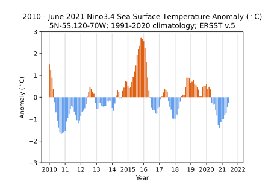

# Nino3.4, an index of the El Niño / Southern Oscillation (ENSO) phenomenon

The Nino 3.4 region sea surface temperature (SST) deviations from climatology (also called
anomalies) is an indicator of the polarity and strength of the El Nino
/ Southern Oscillation phenomenon.  The Nino 3.4 region is the central equatorial Pacific Ocean (5°N-5°S 120-70°W),
and the timeseries of monthly SST anomalies exhibits large year to year fluctuations that define ENSO.  I occasionally update
this figure in this notebook.

<!--  -->

Positive values of this index are associated with positive SST anomalies (red shading) in the equatorial Pacific 
Ocean from approximately 160°E to the South American coast, small negative anomalies (blue shading) in the 
western equatorial Pacific Ocean and equatorial Atlantic, and small positive SST anomalies in the Indian Ocean.
Surface wind anomalies tend to converge into the region of above normal SSTs.  Anomalies of opposite sign are 
associated with negative values of the index.

# July 25-26, 2021.  I am updating the content --- please be patient!

The region of above normal SSTs is associated with above normal preciptation.

ocean
temperature anomalies in this area affect local precipitation which
modifies the Northern Hemisphere atmospheric circulation during
Northern Hemisphere winter and spring seasons, resulting in significant
temperature and precpitation anomalies.   Ocean temperature fluctuations
in this region also influence climate throughout the tropics and in the
Southern Hemisphere in its winter and spring seasons.

The September 2019 update is interesting because the warm anomalies of
the past 12-months have been dramatically erased in the last month,
with a September 2019 anomaly of essentialy zero.  Typically the sign of the Nino 3.4 SST deviation in July is maintained
through at least February-March of the following year.  In 2019, the
anomously warm conditions of May-June-July-August disappated in a
single month.

The SST observations are updated monthly by the Climate Prediction Center of the
National Oceanic and Atmospheric Administration.
