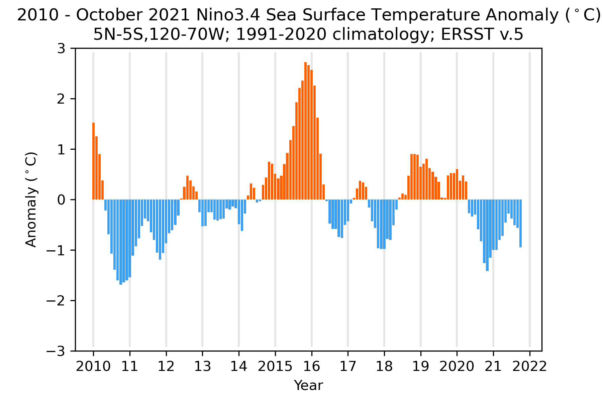

# Nino3.4, an index of the El Niño / Southern Oscillation (ENSO) phenomenon

The Nino 3.4 region sea surface temperature (SST) deviations from climatology (also called
anomalies) is an indicator of the polarity and strength of the El Nino
/ Southern Oscillation phenomenon.  The Nino 3.4 region is the central equatorial Pacific Ocean (5°N-5°S 120-70°W),
and the timeseries of monthly SST anomalies exhibits large year to year fluctuations that define ENSO.

The SST observations are updated monthly by the <a href="https://www.cpc.ncep.noaa.gov/data/indices/">Climate Prediction Center</a> of the National Oceanic and Atmospheric Administration.  I occasionally update the figure presented here.

<!--  -->

Changes in atmospheric surface winds, precipitation, lower atmosphere temperature, sea-level pressure and sea surface temperatures related to fluctuations in the Nino3.4 index are documented in the following maps (<a href="Wallace_etal_1998.pdf">Wallace et al., 1998</a>) and are described below.

Bottom panel: Positive values of Nino3.4 are associated with positive SST anomalies (red shading) in the equatorial Pacific 
Ocean from approximately 160°E to the South American coast, small positive SST anomalies in the Indian Ocean, and small negative
anomalies (blue shading) in the western equatorial Pacific Ocean and equatorial Atlantic.  Tropical surface wind anomalies
tend to converge into the region of above normal SSTs.  Anomalies of opposite sign are associated with negative values of the index.

Top panel: Positive values of Nino3.4 are associated with enhanced oceanic precipitation on the western and northern boundaries of the above normal equatorial Pacific SSTs, and warming of the lower atmosphere throughout the tropics with maxima centered 15° north and south at 130°W.

Middle panel: Tropical anomalous surface winds flow down the gradient of anomalous sea level pressure.

Same as the Top panel above, but from the NCEP/NCAR reanalysis which includes land precipitation anomalies.
